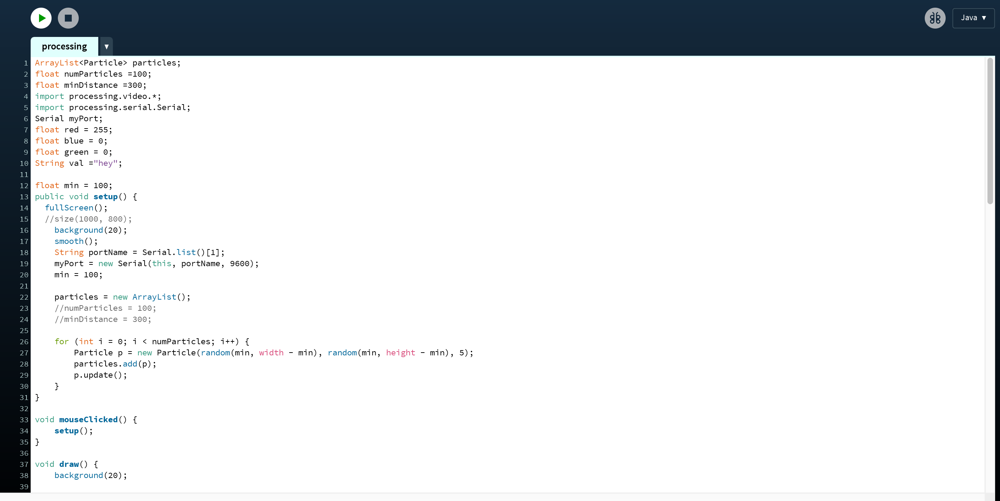

# __Non-human Communication__

## Project Overview

Plants are a vital part of our ecosystem as they release oxygen into the air, store carbon by pulling it from the air, not to mention they can play an essential part of our psychological and physical wellness. Despite all the positive impact that plants have on our lives, research shows that plants are a species that is not as cared about by humans as we ought to be. In fact, our lack of care for plants is characterized as __Plant blindness__, which is a form of cognitive bias about human tendency to ignore plant species.

In an effort to combat this phenomenon, I wanted to explore an area of communication known as __Interspecies Communication (IC)__. IC can be defined as the interchange or transmission of thoughts, opinions, or information by speech with members of another species. The reason I wanted to explore IC is to see if communicating with a different species could increase empathy towards them.

Based on the research I've conducted on the topic of IC, in the form of semi-structured interviews, most participants believed that if they:
> could have a way of communicating with plants, it may lead to [them] being better at taking care of them.

## Plant-Human Communication
The goal for this project was to create a system with which plants and humans can develop a meaningful relationship. The way I envisioned IC is by giving plants feelings, thoughts, a personality, and an overall sense of autonomy. I wanted to do that by implementing an "organic" speech generator for the plant in question so that they could express themselves, however that proved difficult to achieve. So, instead I decided to abstract the communication by outputting interactive art that is altered by plant state.

## The Build
The project consists of two main components, the plant & the visual output.

To recreate this project, you will need:
- 1x Adafruit IO compatible Feather
- 3x jumper wires
- 1x 10k resistor
- Processing
- 1x photocell
- 1x plant(s) of your choosing
- Embroidery hoop
- Invisible Wire

** all materials can be found at [Blick Art Materials](https://www.dickblick.com/)

### Data input
The main way plants are going to input their state is via sensors. I've chosen to work with a photoresistor because you can get a lot of variance in data points, which in turn creates a more visually-pleasing output.

__Wiring__

After you've wired everything, upload the Photo_Cell code to your feather.

This is what the code looks like

In the code, we are reading photoresistors values and sending them to Processing. We've also making a call to an API that structures a sentence when provided with a list of words. The words are randomly chosen for and array of strings. The sentence that is received from the API is then published on an MQTT server.

This is what you should see when you subscribe to the topic on the MQTT side:

Now that you're reading analog data, sending it to processing, and publishing to a channel, it's time to work on the processing code.

Download the processing software and run the code named processing.

**Important notes**
- Your feather must powered on and running the code to send data to processing.
- Processing uses your port so you cant have the IDE serial monitor open
- You must find your port number and change that in the code

Here is what the processing code looks like:

